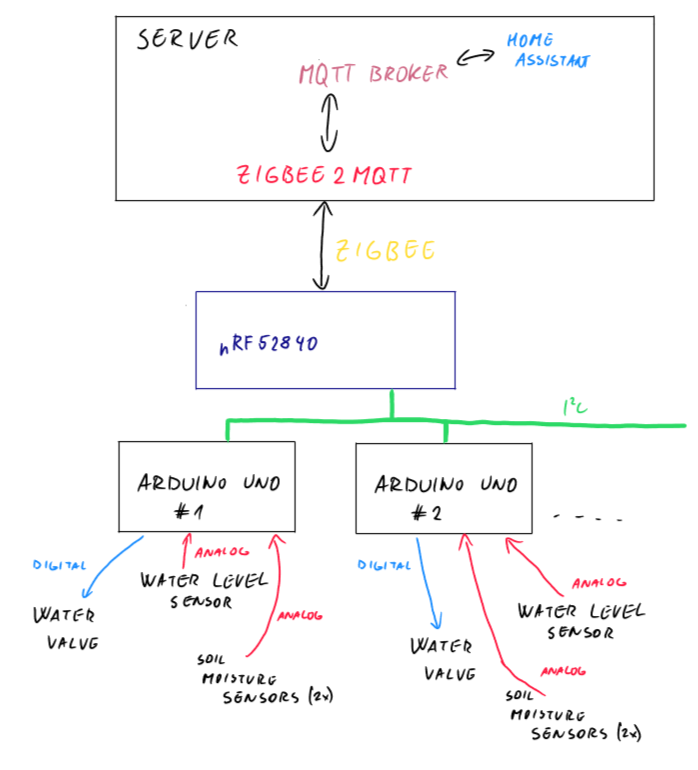

# Smart Garden

A smart garden device that measures soil moisture, the water level in the bowl and regulates plant watering. The concept is that each flowerpot will have a peripheral device with sensors. The peripherals are connected to the controller via I2C, which also powers them. The control unit uses zigbee to communicate with the server. The whole device is powered by a battery.

A simple sketch of this project.

## Peripherals
The peripheral works as I2C slave and measures soil moisture using two analogue sensors, water level (analogue) and can also control water valve (digital output from peripheral). 

Currently only Arduino UNO is supported .

### Arduino UNO
Arduino is connected to the controller via I2C pins. 
Connection is as follows:

| Arduino UNO pin |       Signal      |     End device   |
|:----------------|:------------------|:-----------------|
|   SDA / A4      |      I2C - SDA    | nRF52840 - P0.26 |
|   SCL / A5      |      I2C - SCL    | nRF52840 - P0.26 |
|       A0        | humidity sensor 1 |  humidity sensor analog output |
|       A1        | humidity sensor 2 |  humidity sensor analog output |
|       A2        | water level output|  S pin of the sensor           |
|       D3        | water valve signal| water valve pin  |

### Measuring data
The measurement period is defined by the parameter `MEASUREMENT_INTERVAL_S` (in seconds). The default setting is 30 seconds. The data is measured ten times (attribute `N_MEAS`), then averaged. If they are higher than `average * 1.2` or lower than `average * 0.8`, they are deleted and the average is recalculated from the cleaned data. The range of these values is specified by the `OUT_OF_RANGE_COEFF` attribute. If the measured value is in a range other than 0-1023, you can define your own range for calculating the percentage. All these attributes can be changed in the [config.cpp](/Arduino/include/config.cpp).

### I2C
Every peripheral has unique I2C address from range 0x50 to 0x54. Currently only one peripheral is supported due to issues with multiple zigbee endpoints and server reception.

5 registers were created for communication : 

|  Register name  | Register number | Meaning                     |
|:----------------|:----------------|:----------------------------|
| CONFIG_REG      |     0x01        | Configuration of the device |
| HUMIDITY1_REG   |     0x10        | Humidity 1 data             |
| HUMIDITY2_REG   |     0x11        | Humidity 2 data             |
| WATERLEVEL_REG  |     0x20        | Water level data            |
| WATERVALVE_REG  |     0x30        | Water valve data            |

## Controller - Nordic
Currently is supported only nRF52840 devkit and nRF Connect SDK v2.7.0. 

### Reading data
The board is reading data from peripherals every 30 seconds. 

### Zigbee
Each peripheral has own zigbee endpoint - numbers 11, 12, ..., 15 with these clusters:
 - basic
 - indentify
 - on_off
 - analog_output
 - soil_moisture

#### on_off
`on_off` cluster is used to control water valve. Only the `onOff` attribute is relevat. It coresponds to the `on_off` cluster defined by ZCL. 

#### analog_output
`analog_output` cluster is used for water level measurment. Only `presentValue` is relevant. Cluster ID is `0x0055`.

#### soil_moisture
`soil_moisture` cluster is based on standardized soil_moisture cluster but extended with aditional moisture value. Because of this change, the cluster ID has also been changed to the `0x1459`. Unfortunately, there is no converter for that at the moment.

There is also am aoption to use the default soil_moisture cluster and use some of its attributes for the second moisture sensor e. g. `minValue` attribute.

## Server
### Zigbee2mqtt
To decode zigbee zigbee2mqtt [[2]](/README.md#references) is used. For decoding this device was created special zigbee2mqtt conveter [garden.js](/Zigbee2mqtt/garden.js). [Here](https://www.zigbee2mqtt.io/advanced/support-new-devices/01_support_new_devices.html) is tutorial how to add it to your zigbee2mqtt instance.

### MQTT
MQTT broker Mosquitto[[3]](/README.md#references) is used to get data from zigbee2mqtt.

## Video
[Video](https://photos.app.goo.gl/bV1H2QtREhb4gFk89)

## References
[[1] mak3r - I2C Arduino Slave](https://github.com/mak3r/i2c-arduino-slave/tree/main)

[[2] Zigbee2MQTT](https://www.zigbee2mqtt.io)

[[3] Mosquitto MQTT borker](https://mosquitto.org)

[[4] nobodyguy - Zigbee air quality sensor](https://github.com/nobodyguy/zigbee_air_quality_monitor_firmware/)

[[5] rbaron - b-parasite (Soil moisture sensor)](https://github.com/rbaron/b-parasite/)
